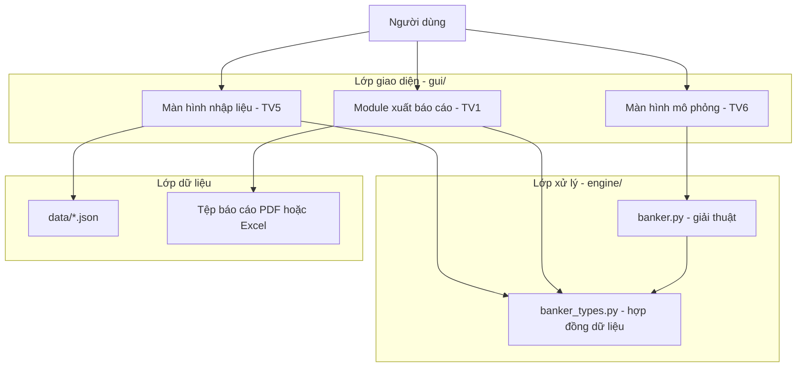
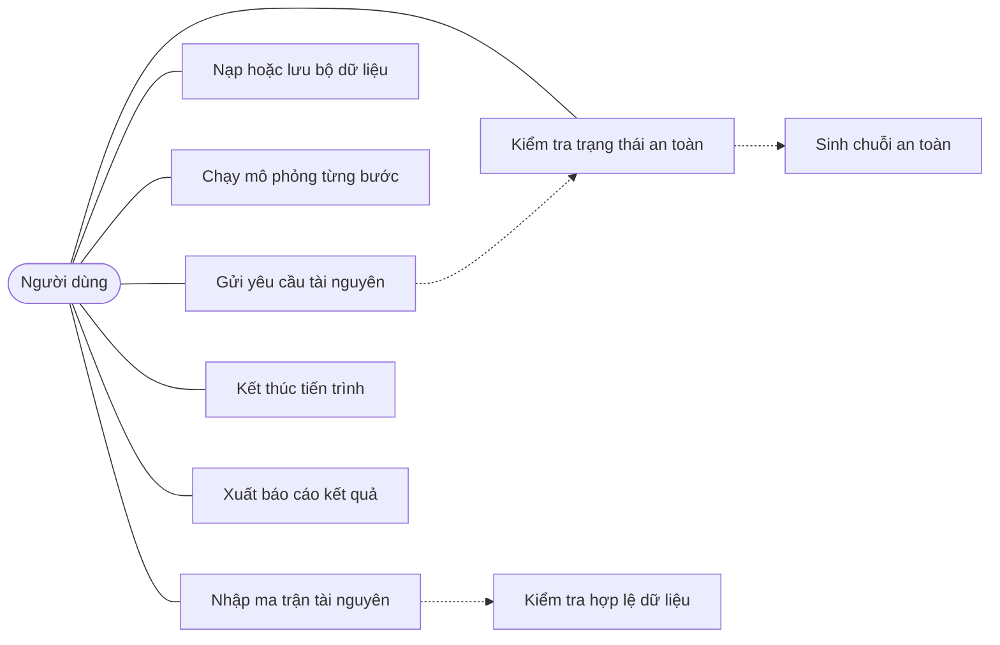
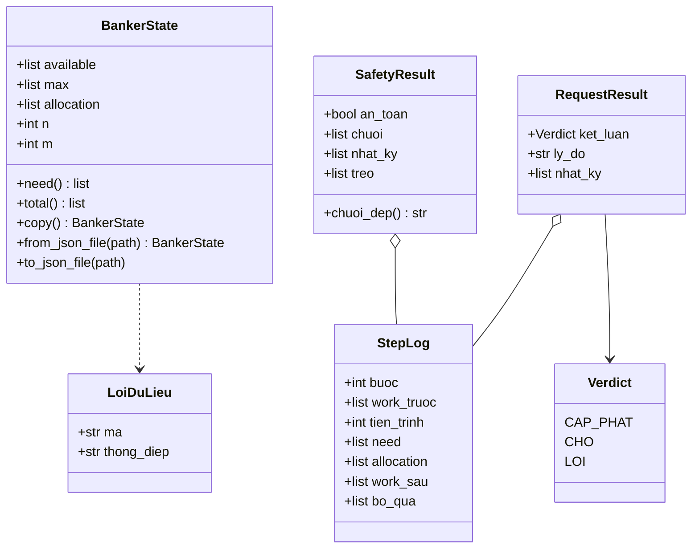
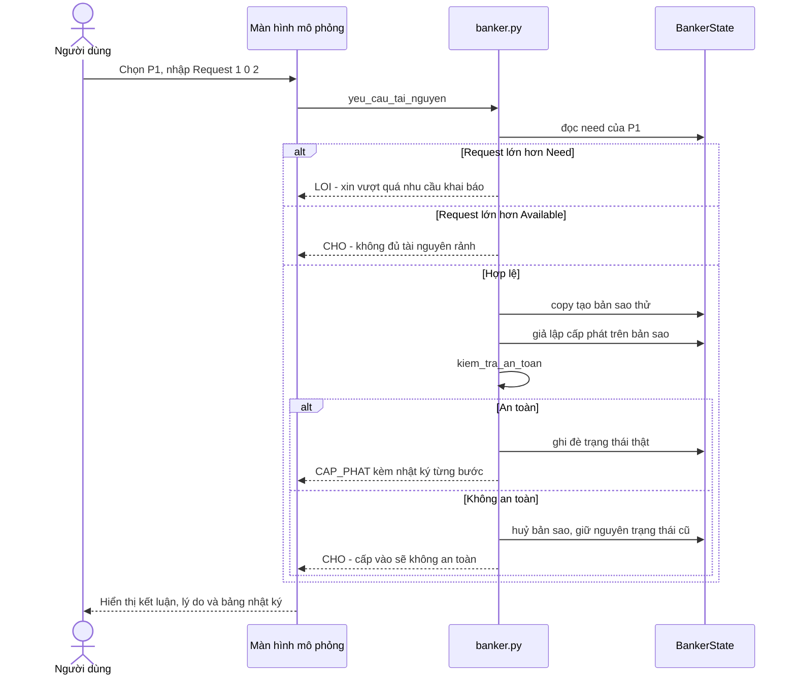

# Chương 4.1 — Kiến trúc chương trình

Chủ sở hữu: TV1. Đây là bản nguồn của Chương 4.1 trong quyển báo cáo. Bốn biểu đồ dưới đây viết bằng Mermaid nên GitHub tự vẽ ra hình — mở file này trên web, chụp màn hình từng hình rồi chèn vào Word, không phải vẽ lại bằng draw.io.

## 1. Nguyên tắc thiết kế

Chương trình chia làm ba lớp tách rời:

| Lớp | Thư mục | Trách nhiệm | Phụ trách |
|---|---|---|---|
| Giao diện | gui/ | Nhận thao tác người dùng, hiển thị kết quả | TV5, TV6 |
| Xử lý | engine/ | Toàn bộ giải thuật Banker | TV4 |
| Dữ liệu | data/ | Bộ dữ liệu mẫu định dạng JSON | TV5 |

Lý do tách lớp xử lý khỏi lớp giao diện: engine không được phụ thuộc vào bất kỳ thư viện đồ hoạ nào, nhờ vậy chạy và kiểm thử tự động được từ dòng lệnh mà không cần mở cửa sổ. Đây cũng là điều kiện để TV8 viết bộ kiểm thử tự động cho thuật toán.

Hợp đồng dữ liệu giữa hai lớp nằm ở engine/banker_types.py, do TV1 định nghĩa và chốt trước khi TV4, TV5, TV6 bắt đầu viết code.

## 2. Hình 4.1 — Sơ đồ khối ba lớp

## 3. Hình 4.2 — Biểu đồ ca sử dụng

Ca sử dụng đáng chú ý nhất là **Gửi yêu cầu tài nguyên**: nó luôn kéo theo ca **Kiểm tra trạng thái an toàn**, vì thuật toán phải giả lập cấp phát rồi mới quyết định chấp thuận hay bắt chờ.

## 4. Hình 4.3 — Biểu đồ lớp

Điểm thiết kế quan trọng: `need` **không phải** dữ liệu lưu trữ mà là thuộc tính tính ra từ `max - allocation` mỗi lần đọc. Nhờ vậy `Need = Max - Allocation` luôn đúng, không bao giờ lệch — đây là lỗi kinh điển khi cài giải thuật Banker.

## 5. Hình 4.4 — Biểu đồ tuần tự: gửi yêu cầu tài nguyên

Nhánh **Không an toàn** là chỗ hay cài sai nhất: phải thao tác trên bản sao rồi mới ghi đè, tuyệt đối không sửa trực tiếp trạng thái thật rồi trừ ngược lại.

## 6. Phân chia tệp và người phụ trách

| Tệp | Nội dung | Phụ trách |
|---|---|---|
| engine/banker_types.py | Hợp đồng dữ liệu dùng chung | TV1 |
| engine/banker.py | Hai thủ tục chính của giải thuật | TV4 |
| engine/demo.py | Chạy thử từ dòng lệnh | TV4 |
| gui/ màn hình nhập liệu | Lưới ma trận, kiểm tra hợp lệ, tệp JSON | TV5 |
| gui/ màn hình mô phỏng | Nhật ký, chạy từng bước, yêu cầu tài nguyên | TV6 |
| gui/xuat_bao_cao.py | Xuất kết quả ra PDF hoặc Excel | TV1 |
| tests/test_banker.py | Bộ kiểm thử tự động | TV8 |
